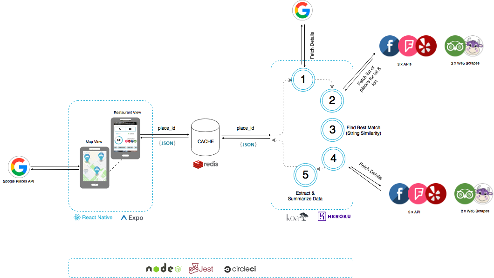

# easy-as-pie-server

#### Architecture

#### Some sample place IDs:

* Le Bistrot Barcelona: ChIJuT9kTBKjpBIRNSy1Grt_ge4
* Market Cuina: ChIJt7oioxejpBIRyRGWOMn0XaE
* Cera 23: ChIJO9Q5t1-ipBIR6j1w_MTknys
* Konyha: ChIJVzC6AWrcQUcRallG8lBArlo

##### Places with weird characters to test:

* Központ (bar in Hungary): ChIJtzkEAGrcQUcRgcggJP56f34
* Vakvarjú: ChIJ602zYGrcQUcRJ-N5Gpjx7kg
* Grünerløkka Brygghus: ChIJqUdI5mhuQUYR1D4a-2P9sHA

##### Place present on all services we are testing:

* Ivan Ramen NYC: ChIJreEXi4FZwokR_ygs7wh2fTk

##### Place with low amount of information:

* Ferry terminal in Yangon: ChIJ7TrmonzswTARjVO_WSl79w0

##### Veggie places

* All you eat is love: ChIJl0ZZHxujpBIRN2y9xZrUuRI
